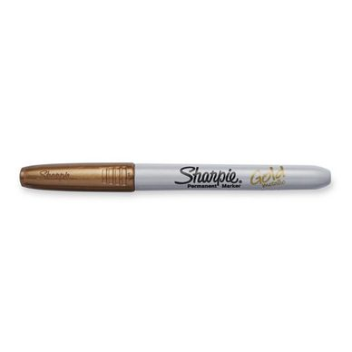

> Sharpie gold pens can be used as an effective glaze resist technique in pottery, alongside traditional methods like wax and masking tape.

## Table of Contents
- [Problem](#problem)
- [Solution](#solution)
- [Important Notes](#important-notes)
- [References](#references)

## Problem

When glazing pottery, ceramists need methods to resist glaze in specific areas to create patterns or leave sections unglazed. Traditional methods include:
- Wax resist
- Masking tape
- Vinyl tape

These methods can be time-consuming or require specific materials that may not always be readily available.

## Solution

Use a **Sharpie Gold Pen** as a glaze resist:

1. Apply the Sharpie gold pen to bisqueware in areas where you want to resist the glaze
2. Allow the ink to dry completely
3. Apply glaze as normal
4. The Sharpie ink will burn off during firing, leaving the marked areas unglazed

## Important Notes

- **Brand and Color Specific**: According to user feedback, it must be specifically:
  - Brand: Sharpie
  - Color: Gold
  - Other brands or colors have not been tested and may not work the same way
- The gold ink burns off completely during the firing process
- This technique provides an alternative to traditional resist methods

## References

- [Instagram Reel - Pen Comparison for Pottery Resist](https://www.instagram.com/reel/C4d2UpTgDoB/)