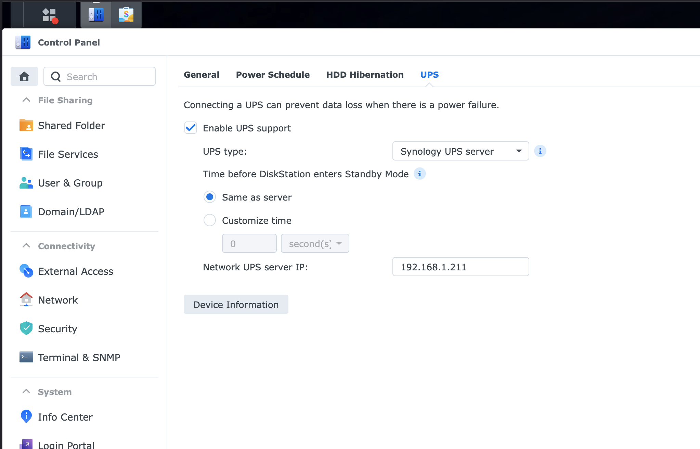

# Synology UPS Network Connectivity

> Synology NAS can only use UPS connected directly or through another Synology device, but there's a workaround using default NUT credentials.

## Table of Contents
- [Problem](#problem)
- [Solution](#solution)
- [References](#references)

## Problem

Synology NAS devices have a limitation where they can only communicate with UPS devices that are:
1. Connected directly to the Synology via USB
2. Connected to another Synology device on the network

This prevents using a UPS that's connected to a different server or device (like a Raspberry Pi) running Network UPS Tools (NUT).

## Solution

Use the default username, password, and device name that Synology expects for NUT communication:

- **Username**: `monuser`
- **Password**: `secret`
- **Device**: `ups`

Configure your NUT server (on Raspberry Pi or other device) with these exact credentials to allow Synology to connect to it as if it were another Synology device.

### Example NUT Configuration

Here's an example configuration for `/etc/nut/upsd.users`:

```conf
[monuser]
    password = secret
    upsmon master
```

### Synology Configuration

On the Synology side, configure the UPS settings as follows:



Key settings:
- **Enable UPS support**: Checked
- **UPS type**: Synology UPS server
- **Network UPS server IP**: Enter the IP address of your NUT server (e.g., 192.168.1.211)

## References

- [Reddit - Synology UPS Network Configuration](https://www.reddit.com/r/synology/comments/12i7j3b/comment/jjfeb1f/)
- [Jeff Geerling - NUT on my Pi, so my servers don't die](https://www.jeffgeerling.com/blog/2025/nut-on-my-pi-so-my-servers-dont-die)