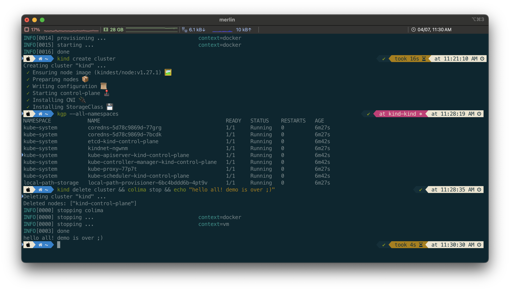

> A comprehensive terminal setup featuring iTerm2, Zsh with Oh My Zsh, Powerlevel10k theme, and syntax highlighting for a productive and visually appealing development environment.

## Table of Contents
- [Problem](#problem)
- [Solution](#solution)
- [Components](#components)
- [Installation](#installation)
- [Configuration Notes](#configuration-notes)
- [References](#references)

## Problem

Setting up a modern, efficient, and visually appealing terminal environment requires multiple tools and configurations. Without proper documentation, recreating this setup on new machines or sharing it with others can be time-consuming and error-prone.

## Solution

Use a combination of best-in-class terminal tools to create a powerful development environment:



## Components

### 1. **iTerm2** - Terminal Emulator
- Modern terminal replacement for macOS Terminal
- Supports split panes, search, autocomplete, and more
- Installation: `brew install --cask iterm2`
- [iTerm2 Official Website](https://iterm2.com/)

### 2. **Solarized Dark** - Color Theme
- Well-balanced color scheme designed for code readability
- Easy on the eyes for long coding sessions
- [iTerm2 Color Schemes](https://iterm2colorschemes.com/)

### 3. **Zsh** - Shell
- Modern shell with powerful features
- Better auto-completion and globbing than bash
- Usually pre-installed on modern macOS

### 4. **Oh My Zsh** - Zsh Framework
- Community-driven framework for managing Zsh configuration
- Hundreds of plugins and themes
- Don't forget to activate relevant plugins
- [Oh My Zsh GitHub](https://github.com/ohmyzsh/ohmyzsh)
- [Oh My Zsh Plugins Directory](https://github.com/ohmyzsh/ohmyzsh/tree/master/plugins)

### 5. **Powerlevel10k** - Zsh Theme
- Fast, flexible, and beautiful prompt theme
- Shows git status, execution time, exit codes, and more
- Note: Looking for alternatives but still very stable
- [Powerlevel10k GitHub](https://github.com/romkatv/powerlevel10k)

### 6. **Source Code Pro** - Font
- Monospaced font designed for coding
- Clear distinction between similar characters
- Excellent readability at small sizes
- [Source Code Pro GitHub](https://github.com/adobe-fonts/source-code-pro)

### 7. **Zsh Syntax Highlighting**
- Real-time syntax highlighting in the terminal
- Helps catch errors before execution
- Visual feedback for valid/invalid commands
- [Zsh Syntax Highlighting GitHub](https://github.com/zsh-users/zsh-syntax-highlighting)

## Installation

```bash
# 1. Install iTerm2
brew install --cask iterm2

# 2. Install Oh My Zsh
sh -c "$(curl -fsSL https://raw.github.com/ohmyzsh/ohmyzsh/master/tools/install.sh)"

# 3. Install Powerlevel10k
brew install powerlevel10k

# 4. Install Source Code Pro font
brew tap homebrew/cask-fonts
brew install --cask font-source-code-pro

# 5. Install Zsh Syntax Highlighting
brew install zsh-syntax-highlighting
```

## Configuration Notes

1. Set `ZSH_THEME="powerlevel10k/powerlevel10k"` in `~/.zshrc`
2. Add `zsh-syntax-highlighting` to the plugins list in `~/.zshrc`
3. Configure iTerm2 to use Solarized Dark color preset
4. Set Source Code Pro as the font in iTerm2 preferences
5. Run `p10k configure` to set up Powerlevel10k

## References

- [iTerm2 Official Website](https://iterm2.com/)
- [iTerm2 Color Schemes](https://iterm2colorschemes.com/)
- [Oh My Zsh GitHub](https://github.com/ohmyzsh/ohmyzsh)
- [Oh My Zsh Plugins](https://github.com/ohmyzsh/ohmyzsh/tree/master/plugins)
- [Powerlevel10k GitHub](https://github.com/romkatv/powerlevel10k)
- [Source Code Pro GitHub](https://github.com/adobe-fonts/source-code-pro)
- [Zsh Syntax Highlighting GitHub](https://github.com/zsh-users/zsh-syntax-highlighting)